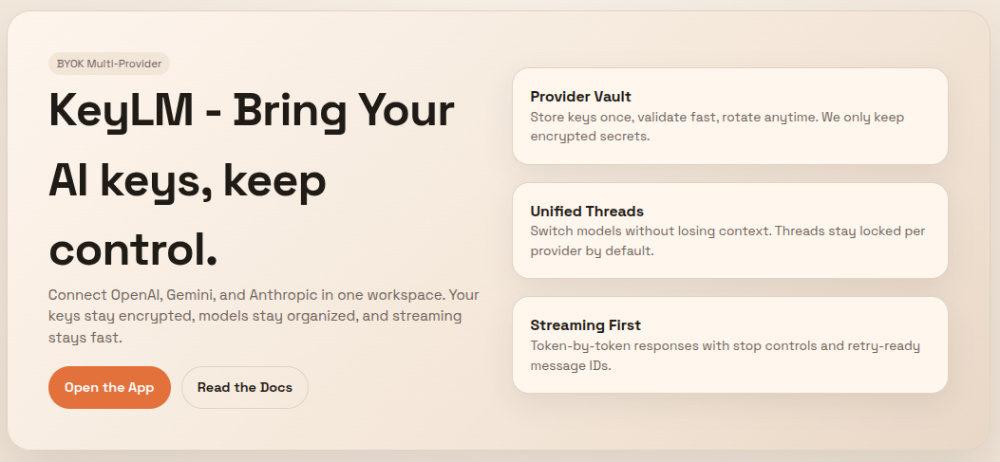

# KeyLM - Bring Your AI

**Your keys. Your models. Your control.**

A unified chat workspace for OpenAI, Gemini, and Anthropic. Store your API keys securely, switch between providers seamlessly, and chat with streaming responses,all in one place.



## ✨ Features

- **BYOK (Bring Your Own Key)** - Use your own API keys from OpenAI, Gemini, and Anthropic
- **Encrypted Storage** - Keys are encrypted at rest and never exposed to the client
- **Multi-Provider Support** - Switch between AI providers without losing context
- **Auto Model Discovery** - Automatically fetches and caches available models per provider
## 🚀 Quick Start

### 1. Install dependencies
```bash
npm install
```

### 2. Configure environment
```bash
cp .env.example .env
```


### 3. Setup database
```bash
npm run prisma:migrate
```

### 4. Run the app
```bash
npm run dev
```

Open [http://localhost:3000](http://localhost:3000) and create an account to get started!


## 🏗️ Tech Stack

- **Frontend**: Next.js 14 (App Router), React, TypeScript
- **Backend**: Next.js API Routes
- **Database**: PostgreSQL with Prisma ORM
- **Auth**: Custom JWT-based authentication
- **Encryption**: AES-256-GCM for API key storage
- **Streaming**: Server-Sent Events (SSE)

## 👨‍💻 Author

** Shakil Ahmed**

- GitHub: [@ahmedmshakil](https://github.com/ahmedmshakil)

